# How do I create an Oracle GoldenGate administrator user in the Enterprise Manager (OEM) console to manage Oracle GoldenGate-specific targets?
Duration: 7 minutes

## Create Oracle GoldenGate Administrator User (ogg 'admin' user)

An instance-level user (or GoldenGate Administrator User) will have certain (or all the granted) privileges as per the business requirements. 

To create this Oracle GoldenGate Administrator User and grant privileges:

1. Ensure that you have discovered Oracle GoldenGate targets in the Oracle GoldenGate Enterprise Manager Plug-in.

2. Click **Setup**, select **Security**, and then click **Administrators**.

    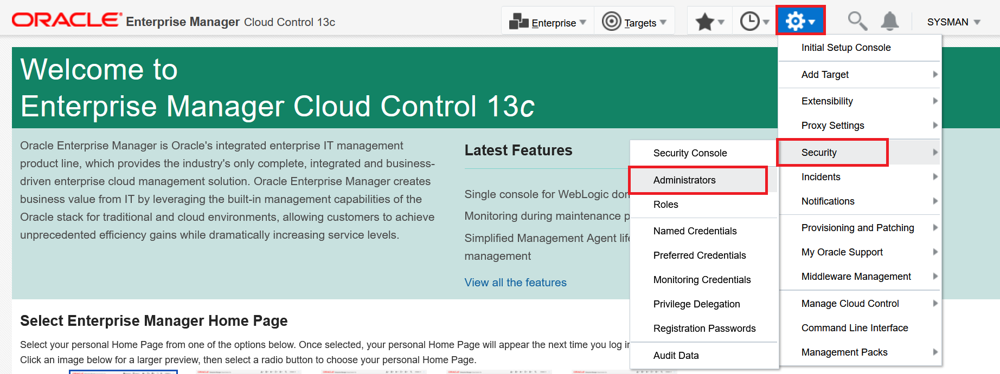

3. In the **Administrators** page, click **Create** to add a new Administrator user.

    

4. In the **Create Administrators: Properties** page, enter the Administrator login Name, for example *oggadmin* and Password, and then click **Next** to display the **Create Administrator: Roles** page.

  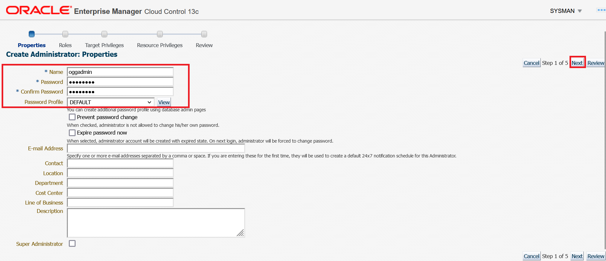

5. Select **EM_USER** and **PUBLIC** under **Selected Roles** and click **Next**.

    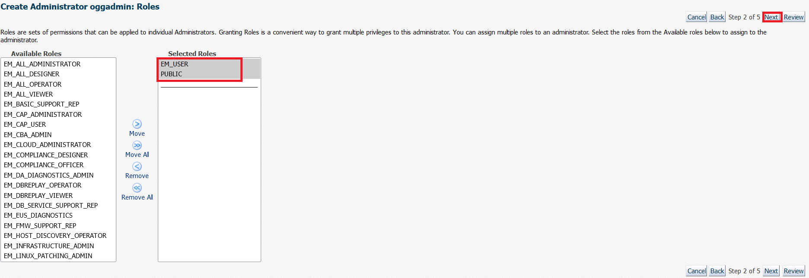

6.  Under **Target Privileges**, click **Add** to display the **Search and Add: Targets** page.

    

7. In the **Search and Add: Targets** page, select the target options and click **Select**. Here, a deployment, administrative service, service manager, receiver service, distribution service, performance service, and extract targets are selected:

    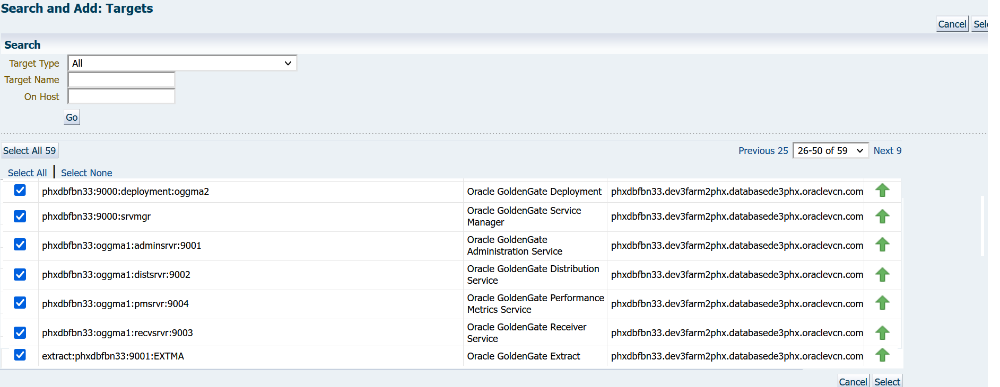

8. Again, under **Target Privileges**, click **Add** to add a Host in the **Search and Add Targets** dialog box. 

9. From the **Target Type** drop-down list, select **Host**, click check box to select the Host, and then click **Select**.

    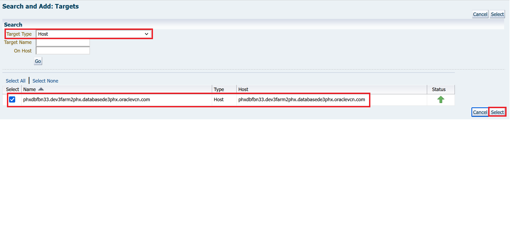

10. Select all the targets (except the Host) and click **Grant to Selected**, and then click **Next**.

    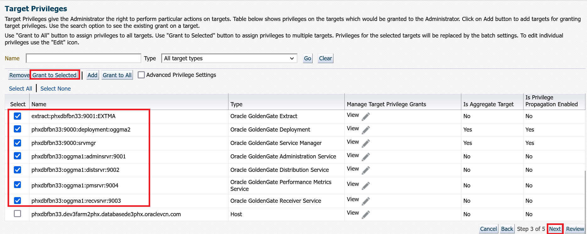

11. Select the following credentials that apply to all targets.  

These Privileges give the administrator the right to perform particular management actions on a class of targets:

   * Edit any OGG parameter file.
   * Run any OGG command.  
   * View contents of any OGG discard file.
   * View contents of any OGG report file.

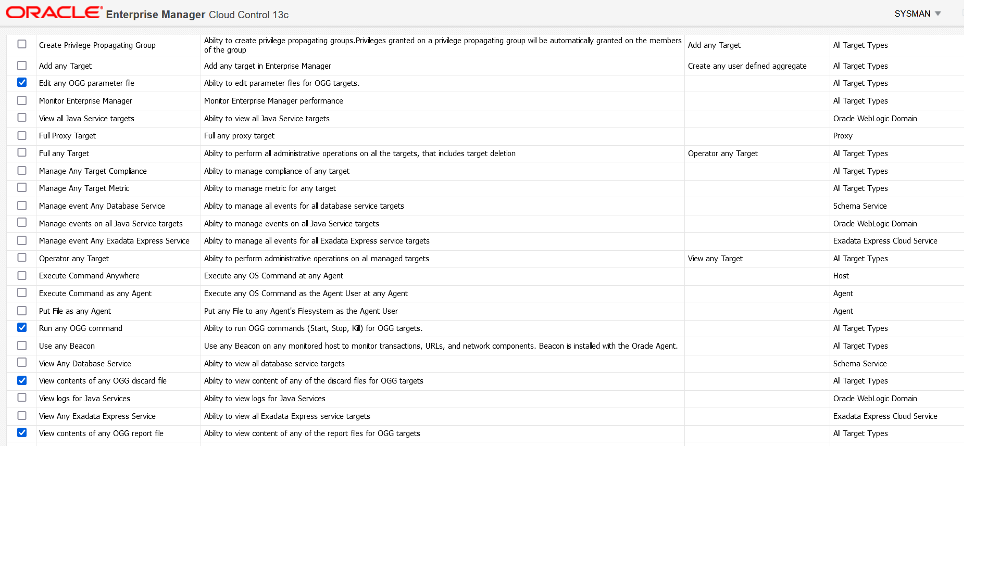

12. Similarly, select the Host and click **Grant to Selected**, select **Operator any Target** privilege as well in addition to the 4 privileges that you selected for the rest of the target types, and click **Continue**.

    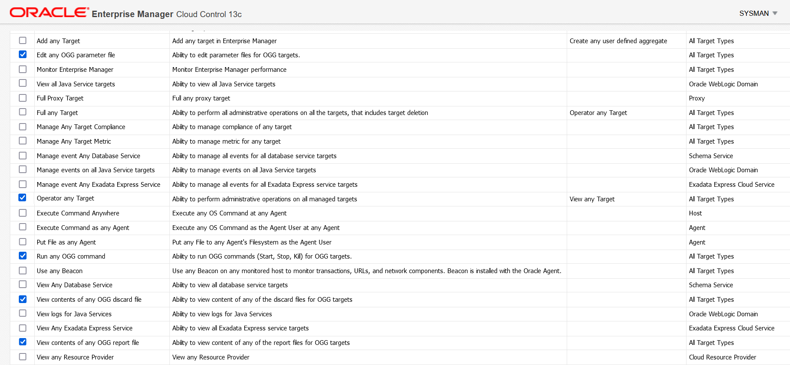

   The selected privileges have been granted:

    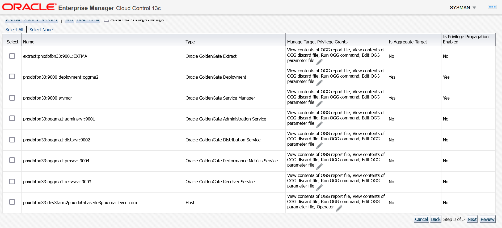
   

13. Click **Review** to view the privileges granted, and then click **Finish**. The Administrator user has been successfully created:

    

14. Click **Setup**, select **Security**, and then click **Named Credentials** to create Named credentials and associate it with the Administrator user.

15. In the **Named Credentials** page, click **Create**.

    

16. In the **Create Credential** page, enter the following details:

    * Credential name: **admincredential**
    * Authentication Target Type: Host
    * Credential type: Host Credentials
    * Target type: Host
    * Target Name: Click **Search** and select the target.

    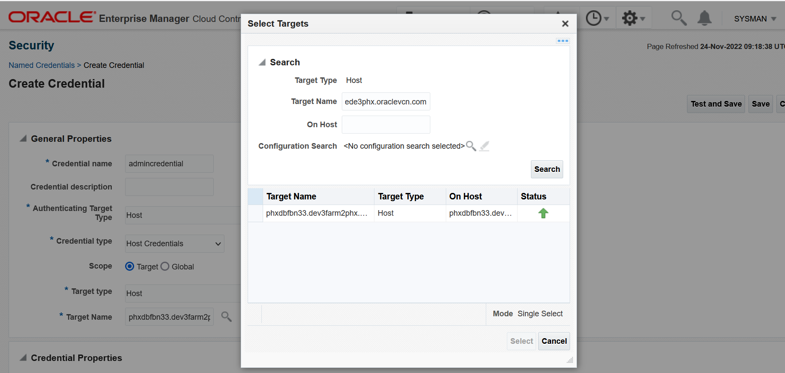

17. Specify the Host credentials:

    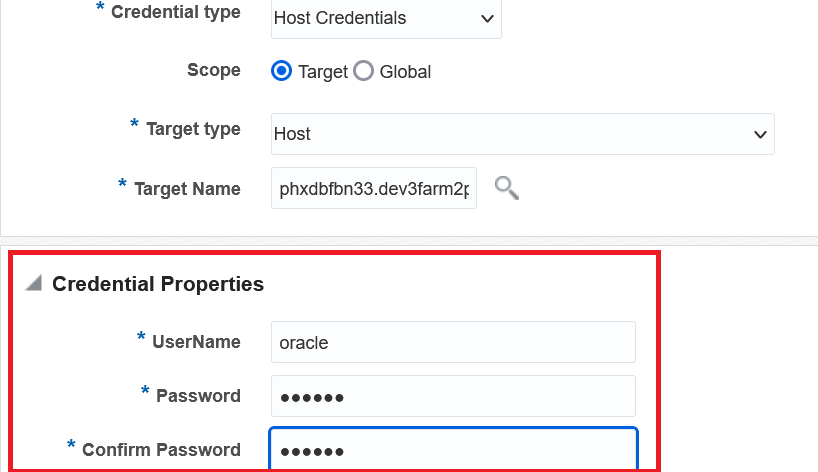

18. Under **Access control**, click **Add Grant** and in the **Search** dialog box, select the Administrator user and click **Select** to add grants to the Administrator user:

    

19. Under **Access Control**, select **Grantee** and click **Change Privileges** to add privliges to the selected Administrator user.

    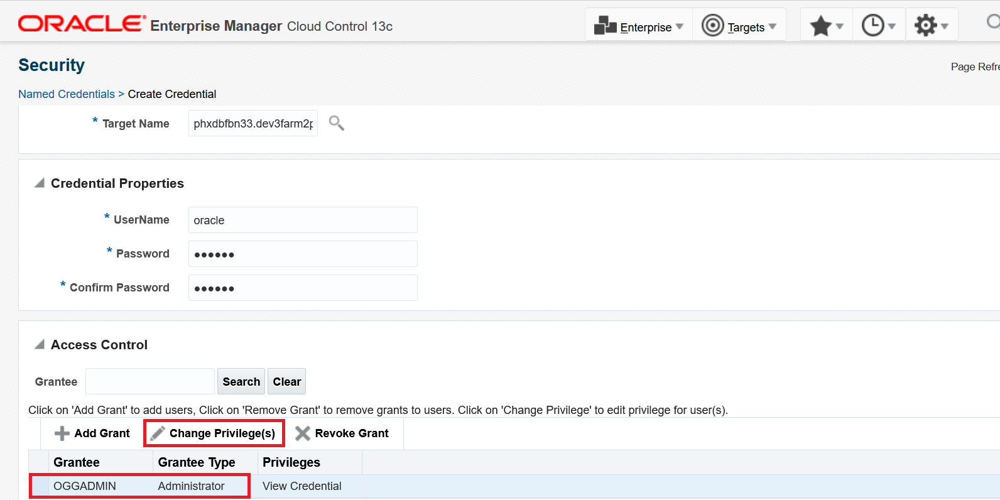

20. In the **Choose privileges for OGGADMIN** page, select **Edit Credential**, **Full Credential**, and **View Credential**, and click **Select**.

    
    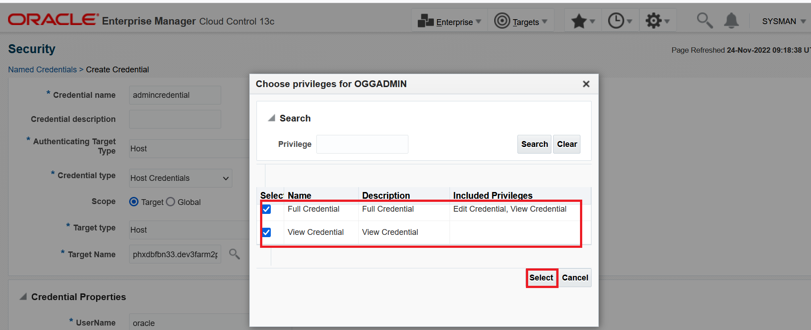

    Credentials have been added to the selected Administrator user:

    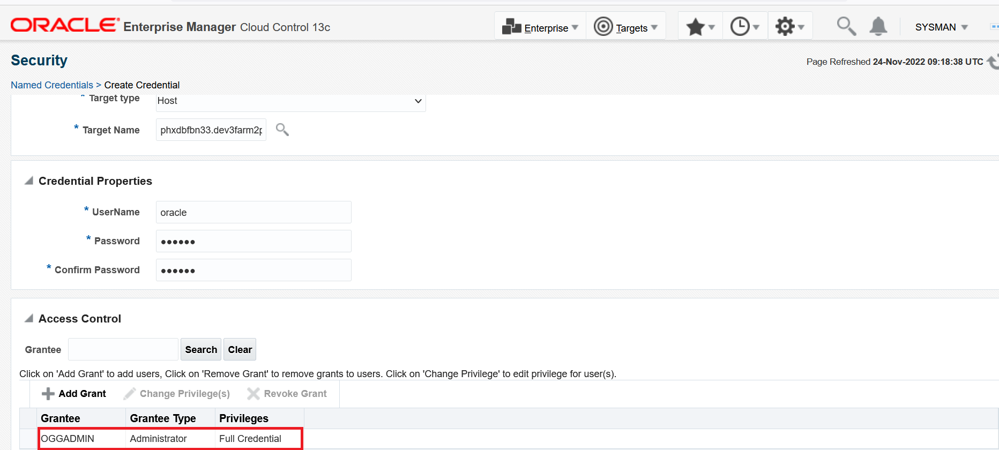
        
21. Click **Test and Save**.

    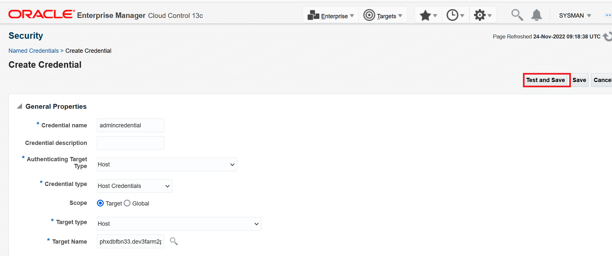

    Credentials have been successfully created and the Administrator user can now monitor the targets.  A **Credential Operation Successful** message is displayed.

    

22. Logout from the current session.

23. Login to the Enterprise Manager Cloud Control, using the new **oggadmin** administrator user credentials.

    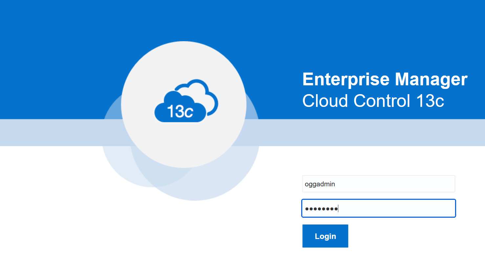
    

24. Click **Targets**, select **GoldenGate** to display the **OGG Home** page, and ensure that all the targets are listed.

25. Click **Setup**, select **Security**, and then click **Preferred Credentials** to display the **Preferred Credentials** page to set the Host Credentials.

26. Select **Oracle GoldenGate Service Manager** and click **Manage Preferred Credentials**.

    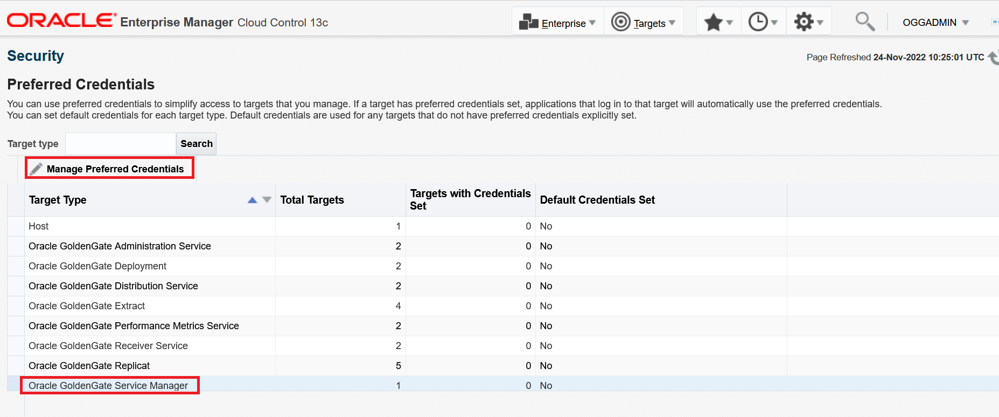

27.	In the **Oracle GoldenGate Service Manager Preferred Credentials** page, under **Target Preferred Credentials**, select **Target Name**, click **Set** to display the **Select Named Credentials** dialog box.

   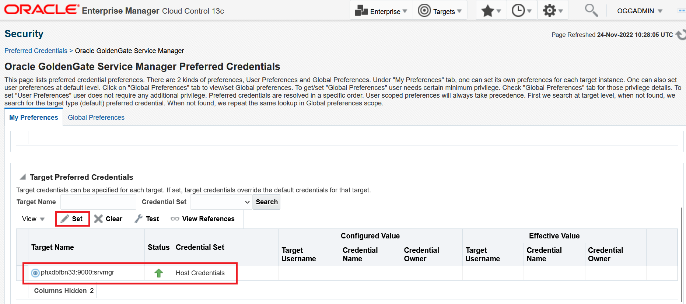
    
28. In the **Select Named Credential** dialog box, ensure that the credential name that you created earlier has been populated, verify the UserName and Password, click **Test and Save**.

    
    
    The Named credential association is completed:

    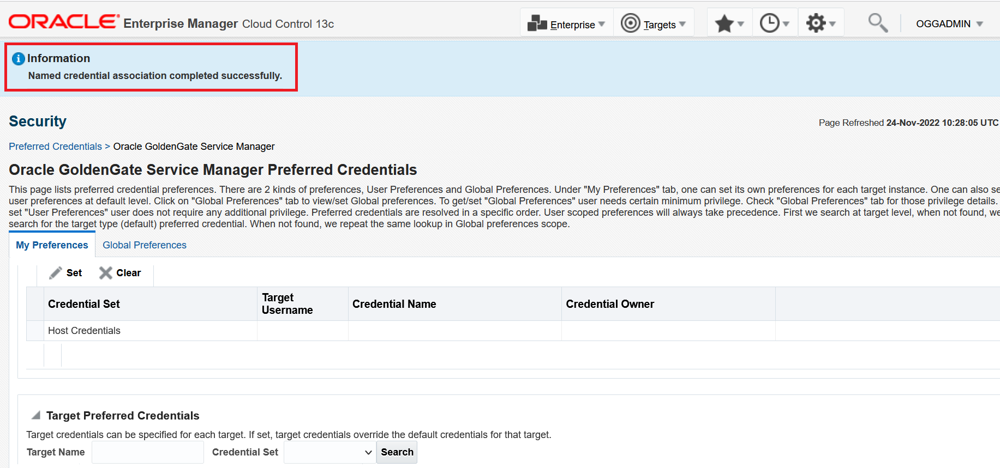

29. Go to **OGG Home** page and select the target, for example **EXTMA** and check whether the you can restart the process from Administrator user.

   
   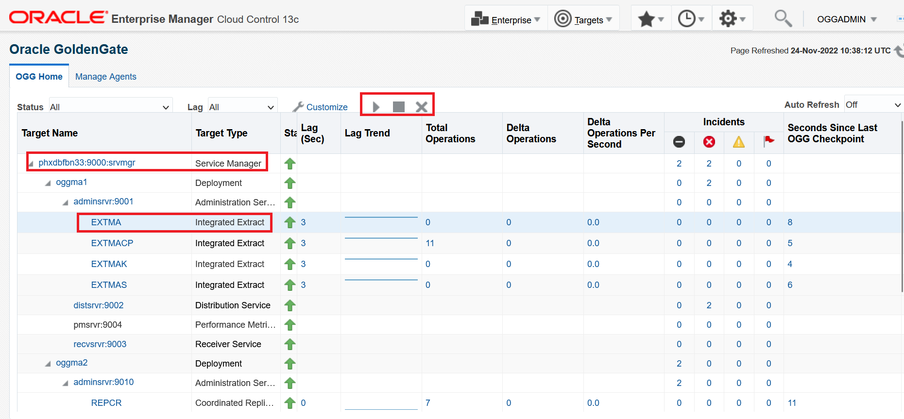
    

## Learn More

* [Discovering an Oracle GoldenGate Enterprise Manager Plug-in Microservices Instance](https://docs.oracle.com/en/middleware/goldengate/emplugin/13.5.2/empug/discovering-oracle-goldengate-targets-ma-instance.html#GUID-A52B6240-189C-4DAB-A017-6358BBB9813B)
* [Discovering an Oracle GoldenGate Enterprise Manager Plug-in Classic Instance](https://docs.oracle.com/en/middleware/goldengate/emplugin/13.5.2/empug/discovering-oracle-goldengate-targets-classic-instance.html#GUID-DD1E8937-3ADE-40FA-9DE2-B01E5CC20D31)
* [New Route to Discovery in Oracle GoldenGate Enterprise Manager Plug-in](https://blogs.oracle.com/dataintegration/post/new-route-to-discovery-in-oracle-goldengate-enterprise-manager-plug-in-134200)
* [Oracle GoldenGate Enterprise Manager Plug-in Documentation](https://docs.oracle.com/en/middleware/goldengate/emplugin/index.html)
