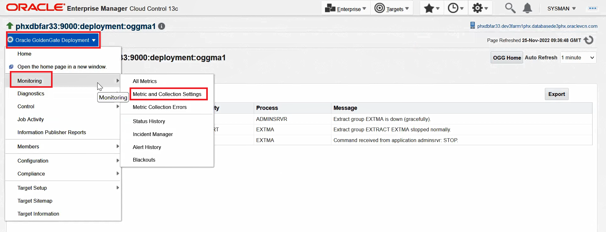
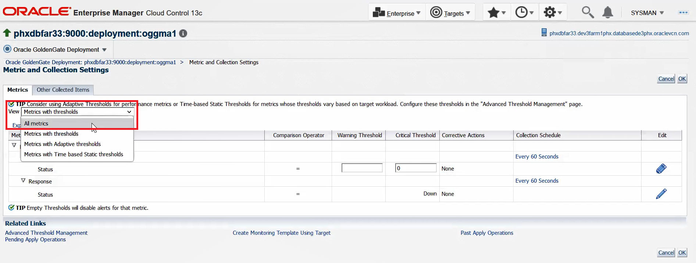
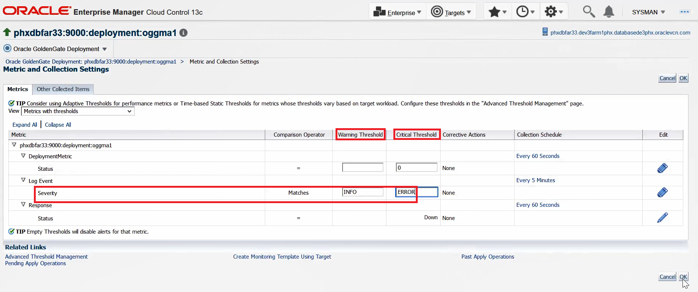
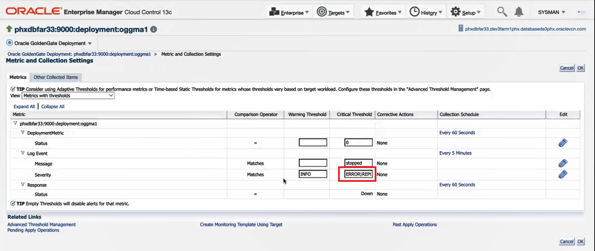
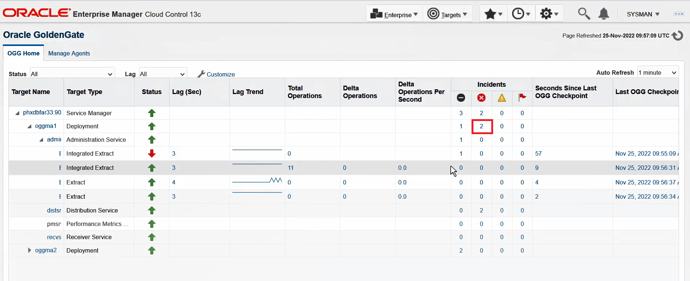
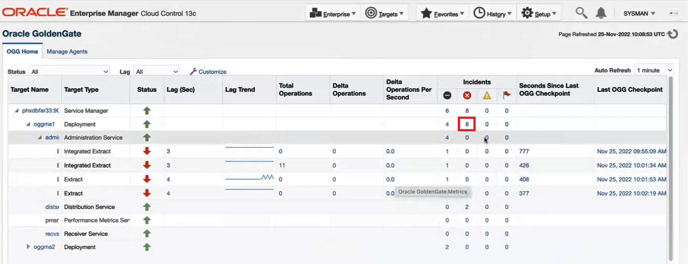
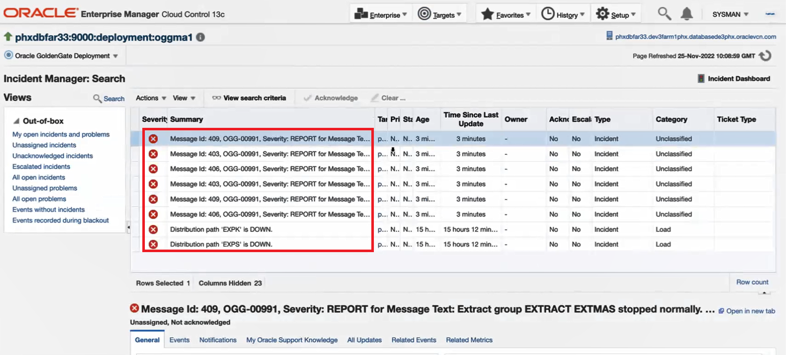

# How do I set alerts in the Oracle GoldenGate Enterprise Manager Plug-in?

Duration: 3 minutes

## Set Alerts

The user can get automatically notified whenever there is an activity at the target level. To enable this automatic notification, you can set alerts in the Oracle Enterprise Manager GoldenGate Plug-in UI.

To set alerts:

1. Ensure that you have discovered Oracle GoldenGate targets and set credentials for them in the Oracle GoldenGate Enterprise Manager Plug-in. See **Learn More**.

2. After you have enabled event messages as explained in **How do I enable Log Events in Oracle GoldenGate Enterprise Manager Plug-in?**, click the **Oracle GoldenGate Deployment** drop-down list, select **Monitoring** and click **Metric and Collection Settings** to display the **Metric and Collections Settings** page.

    

3. Expand the **Metrics with Thresholds** drop-down and select **All Metrics**.

    

4. Set the **Severity**, for **Warning Threshold** and **Critical Threshold** and then click **OK**. The following are a few examples:

    * **Warning Threshold**: INFO
    * **Critical Threshold**: ERROR
    
     

    You can also use wildcard options to enter values for **Severity**, **Message**, **Code**, **Process**, or **Timestamp**. In this example, the OR (|) wildcard is used for entering a value for **Severity**:

    * **Warning Threshold**: INFO
    * **Critical Threshold**: ERROR | REPORT

    

    In the following example, the Astrix (*) wildcard is used for entering a value for **Code**:
    
    
    
    
5. Click **OK** on the Confirmation page.

    
    
6. Click **Targets** and select **GoldenGate** to display the **OGG Home** page. Select an Extract target, start and stop it, and then refresh the page. Notice that the number of incidents have been updated for the Deployment target. 

    

   In the following screenshot, notice the updated number of incident (for wildcard options):

    
    
        
7. Click the number at the **Critical Incident**.

    The alert messages are displayed in the Incident Manager for the **Severity** you have set.
    
    
    
    You can also view the messages from the **All Metrics** page. Select **Oracle GoldenGate Deployment** drop-down, click **Monitoring**, and then select **All Metrics**.

    
    
    Notice the number of alerts on the **All Metrics** page:
    
    
    

## Learn More

* [Discovering an Oracle GoldenGate Enterprise Manager Plug-in Microservices Instance](https://docs.oracle.com/en/middleware/goldengate/emplugin/13.5.2/empug/discovering-oracle-goldengate-targets-ma-instance.html#GUID-A52B6240-189C-4DAB-A017-6358BBB9813B)
* [Discovering an Oracle GoldenGate Enterprise Manager Plug-in Classic Instance](https://docs.oracle.com/en/middleware/goldengate/emplugin/13.5.2/empug/discovering-oracle-goldengate-targets-classic-instance.html#GUID-DD1E8937-3ADE-40FA-9DE2-B01E5CC20D31)
* [Enabling/Disabling Metrics](https://docs.oracle.com/en/middleware/goldengate/emplugin/13.5.2/empug/metric-data.html#GUID-0DA847D6-33E7-4747-A17C-82BF0D1B4D1F)
* [Setting Alerts for Events](https://docs.oracle.com/en/middleware/goldengate/emplugin/13.5.2/empug/incidents-and-alerts.html#GUID-88A8C47C-A127-4579-9849-33C5DF751DFC)
* [New Route to Discovery in Oracle GoldenGate Enterprise Manager Plug-in](https://blogs.oracle.com/dataintegration/post/new-route-to-discovery-in-oracle-goldengate-enterprise-manager-plug-in-134200)
* [Oracle GoldenGate Enterprise Manager Plug-in Documentation](https://docs.oracle.com/en/middleware/goldengate/emplugin/index.html)
